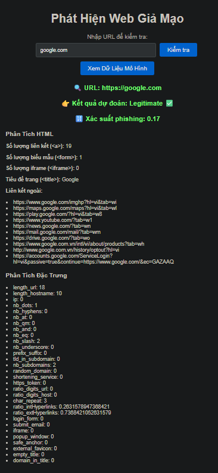

# Phishing Website Detector 🚨




Ứng dụng phát hiện website giả mạo (phishing) dựa trên **Machine Learning** và **Phân tích HTML**.

## 🔍 Chức năng chính
- Nhập URL để kiểm tra website có nguy hiểm hay không
- Phân tích đặc trưng URL và nội dung HTML
- Dự đoán bằng mô hình Ensemble (Logistic Regression + Random Forest + Gradient Boosting)
- Hiển thị xác suất phishing dưới dạng phần trăm
- Xem chi tiết số lượng liên kết, biểu mẫu, iframe, title trang và các liên kết ngoài

## 🧠 Mô hình ML
- Huấn luyện trên dataset `dataset_phishing.csv`
- Dùng `StandardScaler` để chuẩn hóa
- Chia tập train/val/test rõ ràng
- Lưu mô hình bằng `joblib`

### Cấu trúc mô hình
| Thuật toán | Vai trò |
|-----------|---------|
| Logistic Regression | Phân chia tuyến tính |
| Random Forest | Bắt đặc trưng phi tuyến |
| Gradient Boosting | Tăng cường hiệu năng |
| VotingClassifier | Ensemble (Soft Voting) |

## 🧪 Tính năng phân tích HTML
- Số lượng `<a>`, `<form>`, `<iframe>`
- Liên kết ngoài (external links)
- Kiểm tra favicon ngoài domain
- Phát hiện popup script
- Phát hiện login form/email collect

## 🧰 Công nghệ sử dụng
- Python, FastAPI
- Scikit-learn
- BeautifulSoup4
- Requests
- Uvicorn
- Joblib

## 🚀 Cách chạy dự án
```bash
pip install -r requirements.txt
uvicorn main:app --reload
```

Sau đó mở trình duyệt tại:
```
http://localhost:8000
```

## 📁 Cấu trúc thư mục đề xuất
```
📦 PhishingDetector
 ├─ main.py
 ├─ ensemble_model.pkl
 ├─ scaler.pkl
 ├─ preprocessed_data.pkl
 ├─ model_info.pkl
 ├─ dataset_phishing.csv
 ├─ static/
 │   ├─ index.html
 │   ├─ style.css
 │   └─ script.js
 ├─ README.md ✅
 └─ requirements.txt
```

## ✨ Demo Kết quả
Ví dụ kiểm tra URL:
```
URL: https://google.com
Dự đoán: Legitimate ✅
Xác suất phishing: 0.17
```

## 📌 Ghi chú
Một số website chặn scrape HTML, có thể không phân tích đủ feature HTML nhưng vẫn dùng feature URL để dự đoán.

---


## Tác giả
Tú +Hiếu